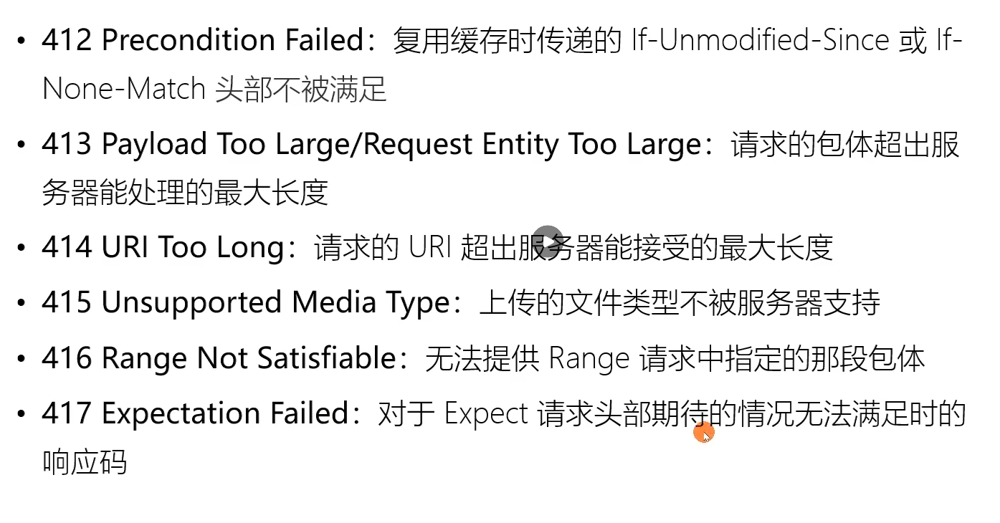
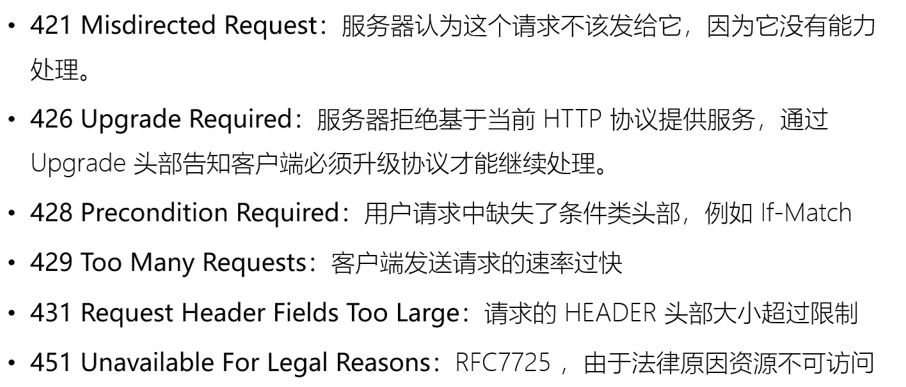
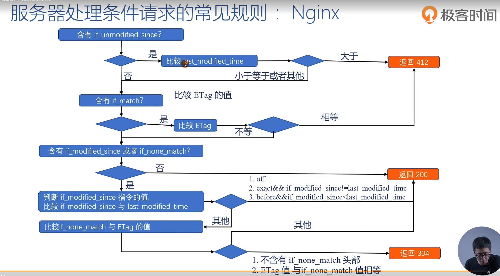
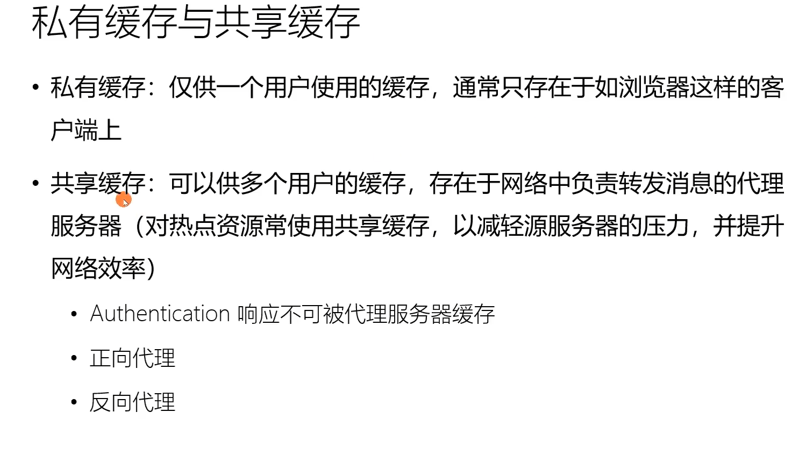
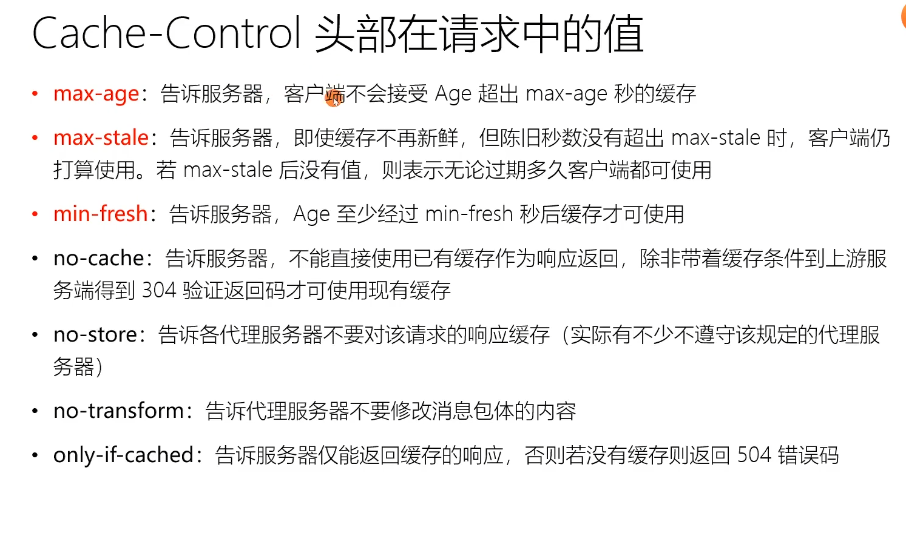
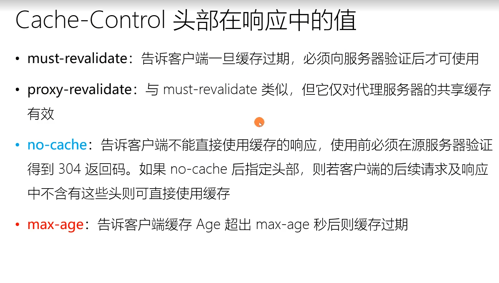
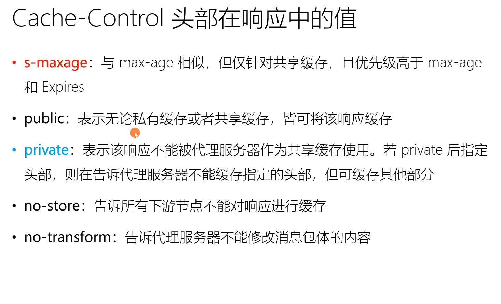
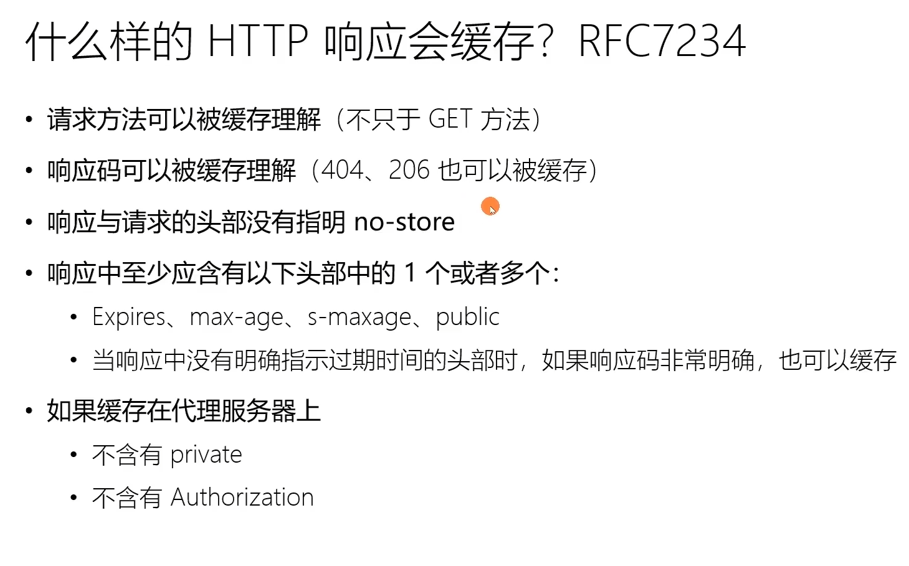
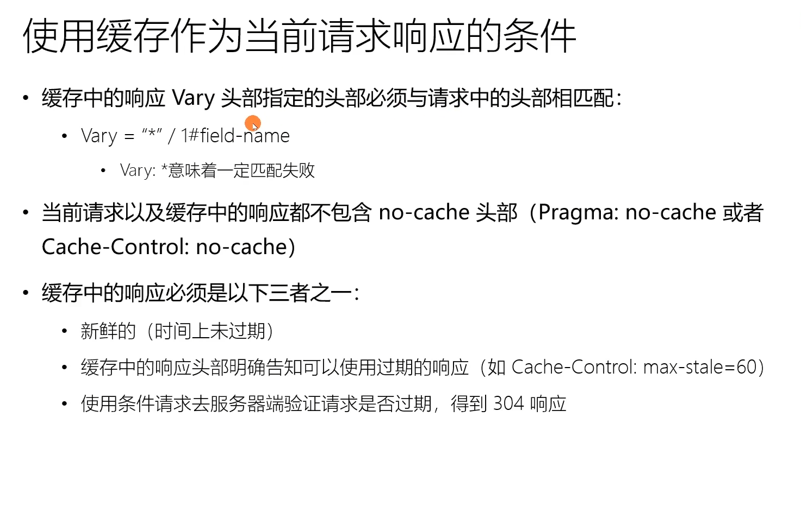
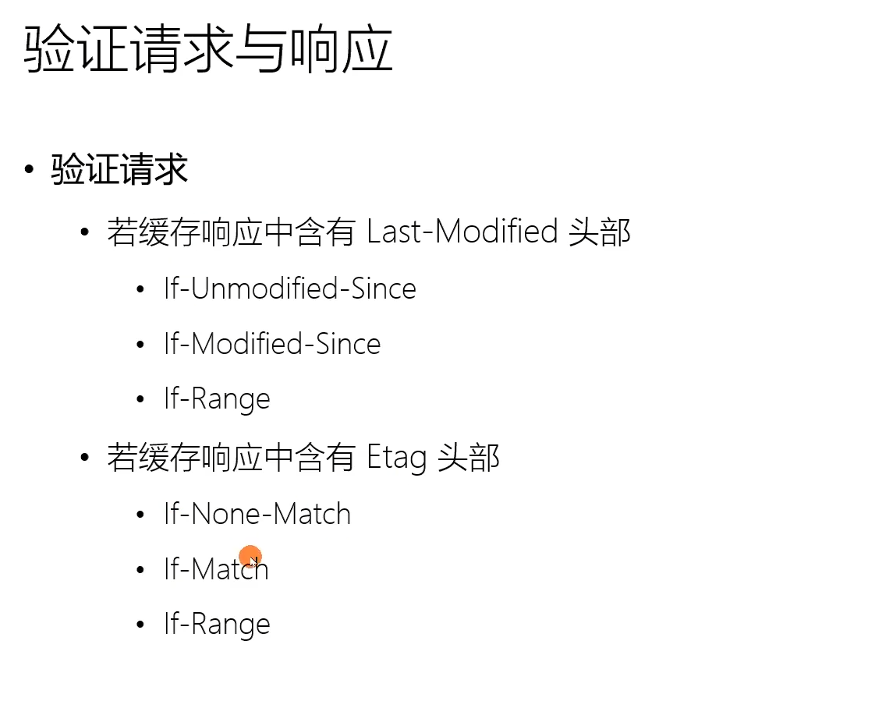

## 五层模型
- 应用层：为应用提供接口服务等(HTTP/FTP协议)
- 传输层：定义传输数据的协议(TCP/UDP)。
- 网络层：端到端的包传输，主机的链接，ip寻址(ip协议)。
- 数据链路层：将网络层的ip数据封装成帧，每个帧包括数据和控制信息(地址信息，差错控制等)
- 物理层：定义物理设备标准,如网线接口，光纤接口类型。它的主要作用是传输比特流。

## 浏览器中输入url，回车后发生了什么
查看请求资源是否有缓存，如果有强制缓存则直接使用缓存。 
如果是协商缓存则发起请求，校验缓存是否可用。 
(Expires和Cache-Control这两个HTTP头来判断。Expires的值为一个绝对时间表示缓存过期时间；Cache-Control:max-age=，值为以秒为单位的缓存有效时间。)

DNS解析，查找过程：1.浏览器缓存；2.本地缓存；3.hosts文件；4.路由器缓存；5.本地域名解析系统 6.根域名服务器 =》 顶级域名服务器 =》 权限域名服务器

端口建立TCP连接： 
1.客户端发送 SYN=1, Seq=X的包到服务器端口   客户端：SYN_SENT  服务端：SYN_RECEIVED   
2.服务器发送 SYN=1, ACK=X+1, Seq=Y 的响应包  客户端：ESTABLISHED  服务端：SYN_RECEIVED   
3.客户端发送 ACK=Y+1, Seq=Z 的响应包  客户端：ESTABLISHED  服务端：ESTABLISHED   

建立TCP连接后发送HTTP请求 
服务器接收请求返回相应的响应数据 
首先会判断相应的状态码是多少，400或500就报错，300会进行重定向，200则继续解析 
浏览器拿到请求的内容开始解析文件，如果是gzip格式会先解压，然后通过文件的编码格式决定如何解码文件。 
文件解码后，开始渲染页面： 
根据html构建DOM树，根据css构建cssOM树，中间遇到script标签，会判断是否是异步执行（async/defer） 
async会并行下载执行js，不会影响当前解析，不保证执行顺序 
defer会先下载文件，等到html解析完成后再顺序执行 

若没有这两个标签，会阻塞渲染，等待脚本同步执行完成 

CSSOM树和DOM树构建完成后会开始生成渲染树，浏览器调用GPU绘制，合成图层，绘制内容到页面上 

## TCP 4次挥手
1.客户端向服务端发送释放连接请求 FIN  客户端：FIN_WAIT_1 服务端：ESTABLISHED   
2.服务端收到请求，向客户端发送ACK包，服务端进入CLOSE_WAIT状态，不再接收客户端的数据。但服务端仍旧可以发送数据给客户端。  
3.服务端发送完剩下的数据，完毕后向客户端发送释放连接请求，服务端进入 LAST_ACK状态。 
4.客户端收到释放连接请求后，向服务端发送确认应答，客户端进入TIME_WAIT阶段，该状态会持续2MSL（最大段生存期，指报文段在网络中生存的时间，超时会被抛弃）时间。若这个时间段内没有收到服务端的重发请求，则进入CLOSED状态。服务端收到确认应答后，也进入CLOSED状态。

## HTTP

### get和post

1.get请求在浏览器回退时是无害的，post则会再次请求。
2.get请求可以缓存，post不能
3.get请求数据包含在url中，post请求数据在request body，存储的数据可以更多
4.get多用于不改变资源的请求，post反之

### 常见状态码

#### 1XX 
指示信息，表示请求已接收，需要进一步处理才能完成，HTTP1.0不支持
 - 100 Continue： 上传大文件前使用（如迅雷)  由客户端发起请求中携带 Expect： 100-continue 头部触发
 - 101 Switch Protocols： 协议升级使用     由客户端发起请求中携带 Upgrade 头部触发  （如升级websocket、http2.0
 - 102 Processing: 表示服务器已经收到并正在处理请求，但无响应可用
#### 2XX
200 OK：请求成功 
201 Created：通常指POST请求的结果，已在服务器上成功创建新的资源。 
202 Accepted：请求已接收处理，但处理尚未完成。 
204 No Content：请求成功，但相应报文不包含实体部分(暗示客户端无需更新当前视图。 
205 Reset Content：请求成功，但相应报文不包含实体部分(指明客户端需要更新当前视图。 
206 Partial Content：请求成功，仅返回部分响应内容，并且主体包含的数据区间是请求的Range首部指定的。 
207 Multi-Status：RFC4918, 在WEBDAV协议中以XML返回多个资源的状态。 

#### 3XX  重定向使用Location指向的资源或者缓存中的资源。 在RFC2068中规定客户端重定向次数不应超过5次，以防止死循环。
301 Moved Permanently: 永久重定向(方便浏览器对重定向资源进行缓存)。 
302 Found：临时重定向。 
303 See Other：重定向到其他资源，常用于POST/PUT等方法的响应中。 
304 Not Modified：告诉客户端可以复用缓存（自从上次请求后，请求的网页未修改过）。 
307 Temporary Redirect：类似302，但明确重定向后请求方法必须与原请求方法相同，不得改变。 
308 Permanent Redirect：类似301，但明确重定向后请求方法必须与原请求方法相同，不得改变。 

#### 4XX
400 Bad Request：服务器认为客户端出现了错误，但不能明确判断为以下哪种错误。 如HTTP请求格式错误 
401 Unauthorized：用户认证信息缺失或者不正确，导致服务器无法处理请求。 
407 Proxy Authentication Required：对需要经由代理的请求，认证信息未通过代理服务器的验证。 
403 Forbidden：服务器理解请求的含义，但没有权限执行此请求。 
404 Not Found：请求资源不存在。 
410 Gone：请求资源不存在，且该位置永久性找不到该资源。 
405 Method Not Allowed：服务器不支持请求行中的method方法。 
406 Not Acceptable：对客户端指定的资源表述不存在（例如对语言或者编码有要求）。 
408 Request Timeout：服务器接受请求超时。 
409 Conflict：资源冲突，例如上传文件时目标位置已经存在版本更新的资源。 
411 Length Required：如果请求含有包体且未携带Content-Length头部，且不属于chunk类请求时，返回411。 

#### 5XX
500 Internal Server Error：服务器处理请求时发生内部错误。 
501 Not Implemented：服务器不支持当前请求的某个功能。 
502 Bad Gateway：代理服务器无法获取到合法响应。 
503 Service Unavailable：服务器超负载或停机维护、限流、限ip等 

Connection仅针对当前连接有效

### Http数据协商

客户端发送请求时，会声明可以接收的数据格式和相关的限制；服务端在接收时会根据这个信息判断返回怎样的数据

#### 请求
Accept： 申明想要的数据格式 
Accept-Encoding：告诉服务端以怎样的方式来压缩(如gzip) 
Accept-language：描述语言信息 
User-Agent：描述客户端浏览器相关信息，可以用来区分PC端和移动端页面 
Referer: 浏览器对来自某一页面的请求自动添加头部（服务器端常用于统计分析、缓存优化、防盗链（有些资源不希望被直接引用）等功能）。 
From：主要用于网络爬虫，告诉服务器如何通过邮件联系到爬虫的负责人。

#### 响应
Content-Type: 对应Accept，服务端返回数据类型(从请求中的Accept选一种来返回) 
Content-Encoding: 对应Accept-Encoding，指服务器使用哪种压缩方式 
Content-Language：对应Accept-language 
Server：指明服务器上所用软件信息，用于帮助客户端定位问题或者统计数据。 
Allow: 告诉客户端，服务器上该URI对应的资源允许哪些方法的执行。 
Accept-Ranges: 告诉客户端服务器上该资源是否允许range请求。 

### HTTP2

Http1.1的问题：
 - 随着带宽的增加，延迟并没有显著下降
 - 并发连接有限（6个）
 - 同一连接同时只能完成一个HTTP事务（请求/响应）
 - 无状态特性带来的巨大HTTP头部，重复传输体积巨大的HTTP头部

1.多路复用
2.hpack算法压缩头部
3.通过push_promise 帧 服务器推送

HTTP2相较于HTTP1，大幅提高了web的性能 
HTTP2采用二进制格式传输，并且提供了乱序传递，替代了HTTP1的文本格式，二进制的格式解析更为高效 

多路复用代替了HTTP1的序列和阻塞机制，所有在相同域名下的请求都通过一个TCP连接并发完成 
HTTP2中有两个概念，帧和流，帧代表最小的数据单位，每个帧上会表示出属于哪个流 
多路复用，就是一个TCP连接中可以存在多条流，对端可以通过帧中的标识知道属于哪个请求。通过这个技术，可以避免HTTP旧版本队头阻塞的问题。 

Header压缩：在 HTTP 2.0 中，使用了 HPACK 压缩格式对传输的 header 进行编码，减少了 header 的大小。并在两端维护了索引表，用于记录出现过的 header ，后面在传输过程中就可以传输已经记录过的 header 的键名，对端收到数据后就可以通过键名找到对应的值。 

### HTTPS

#### 对称加密
对称加密又称私钥加密，即信息的发送方和接收方使用同一个密钥去加密和解密数据。 
对称加密的特点是算法公开，加密和解密速度快，适合于对大数据量进行加密。 

#### 非对称加密
非对称加密也叫作公钥加密。安全性更好。 
对称加密的通信双方使用相同的密钥，如果一方的密钥遭泄露，那么整个通信就会被破解。 
非对称加密使用一对密钥，即公钥和私钥，且二者成对出现。私钥被自己保存，不能对外泄露。公钥指的是公共的密钥，任何人都可以获得该密钥。
用公钥或私钥中的任何一个进行加密，另一个进行解密。 
非对称加密的缺点是加密和解密花费时间长，速度慢，只适合对少量数据进行加密。 

HTTPS协议 = HTTP协议 + SSL/TLS协议。在HTTPS数据传输过程中，需要SSL/TLS对数据进行加密和解密，由HTTP传输。 
HTTPS为了兼顾安全与效率，同时使用了对称加密和非对称加密。 
对传输数据进行对称加密，对称加密所要用的密钥通过非对称加密传输 

HTTPS传输过程：
一个HTTPS请求实际上包含了两次HTTP传输，可以分为8步： 
1.客户端向服务端发起HTTPS请求，连接到服务器的443端口。 
2.服务端有一个密钥对，即公钥和私钥，服务端保存着私钥，不将其泄露，公钥可以发送给任何人。 
3.服务器把公钥发给客户端。 
4.客户端接收到公钥，并验证其合法性。然后随机生成一个私钥，用服务端公钥对其进行加密。 
4.客户端把加密后的客户端私钥发给服务端。 
5.服务端用服务端私钥对接收的密文进行非对称解密，拿到客户端私钥。 
6.用客户端私钥对传输数据进行加密。 
7.返回加密数据。 
8.客户端接收到密文，用客户端私钥进行对称解密，得到服务端发送的数据 

### cookie localStorage sessionStorage

#### cookie:
服务器通过设置 set-cookie 这个响应头，将cookie信息返回给浏览器。 
浏览器将响应头中的cookie信息保存在本地，下次向服务器发起请求时（同源请求），浏览器会自动将保存的这些cookie信息添加到请求头中。 
服务器通过cookie信息判断用户的信息、状态。

- 通过set-cookie设置
- 下次请求会自动带上
- 键值对，可设置多个

##### cookie属性
- max-age
    - 有效时间（默认在浏览器关闭时失效）
- expires
    - 过期时间点
- secure
    - 表示这个cookie只会在https请求的时候才会发送
- HttpOnly
    - 设置后无法在js中通过document.cookie访问
- domain
    - 表示cookie对于哪个域是有效的
    
##### session与cookie的区别
- session保存在服务端，cookie保存在客户端。
- session 有对应的sessionId，sessionId存储在cookie中。每次访问服务端从cookie中取出sessionId，再拿到对应的session信息。
- session会消耗服务器资源。cookie在每次http请求都会带上，影响网络性能。
- 域的支持范围不一样，比方说a.com的Cookie在a.com下都能用，而www.a.com的Session在api.a.com下都不能用。

### localStorage/sessionStorage

- localStorage/sessionStorage仅在本地保存，不会自动发送给服务器。
- cookie数据大小不超过4k，localStorage/sessionStorage 能达到5M。
- sessionStorage 在浏览器标签关闭后自动删除，localStorage若没有设置过期时间则永久有效。

## 浏览器缓存

缓存优先级： s-maxage(用于共享缓存) > max-age > Expires > 预估过期时间

预估过期时间：
(DownloadTime - LastModified) * 10%

###强制缓存
当浏览器向服务器发起请求时，服务器会将缓存规则放入HTTP响应报文的HTTP头中，和请求结果一起返回给浏览器。 
控制强制缓存的字段分别是Expires和Cache-Control，其中Cache-Control优先级更高。 

#### Expires
Expires是HTTP/1.0控制网页缓存的字段，其值为服务器返回该请求结果缓存的到期时间，即再次发起该请求时，如果客户端的时间小于Expires的值时，直接使用缓存结果。 
到了HTTP/1.1，Expire已经被Cache-Control替代，原因在于Expires控制缓存的原理是使用客户端的时间与服务端返回的时间做对比，
那么如果客户端与服务端的时间因为某些原因（例如时区不同；客户端和服务端有一方的时间不准确）发生误差，那么强制缓存则会直接失效，
这样的话强制缓存的存在则毫无意义。 

#### Cache-Control
- public: 所有内容都将被缓存(客户端和代理服务器都可缓存)
- private: 所有内容只有客户端可以缓存。(Cache-Control的默认值)
- no-cache: 客户端缓存内容，但是否使用缓存需要协商缓存来验证决定。
- no-store: 所有内容都不会被缓存，既不使用强制缓存，也不使用协商缓存。
- max-age=xxx: 缓存内容将在xxx秒后失效

####缓存存放位置
在浏览器中，浏览器会在js和图片等文件解析执行后直接存入内存缓存中，
那么当刷新页面时只需直接从内存缓存中读取(from memory cache)；
而css文件则会存入硬盘文件中，所以每次渲染页面都需要从硬盘读取缓存(from disk cache)。

###协商缓存
协商缓存就是强制缓存失效后，浏览器携带缓存标识向服务器发起请求，由服务器根据缓存标识决定是否使用缓存的过程。主要有两种情况： 
1. 服务端返回304，协商缓存生效。 
1. 服务端返回200，协商缓存失败。 

协商缓存的标识也是在响应报文的HTTP头中和请求结果一起返回给浏览器的，
控制协商缓存的字段分别有：Last-Modified / If-Modified-Since 和 Etag / If-None-Match，
其中Etag / If-None-Match的优先级比Last-Modified / If-Modified-Since高。 

#### Last-Modified / If-Modified-Since
Last-Modified是服务器响应请求时，返回该资源文件在服务器中最后被修改的时间。 
If-Modified-Since 则是客户端再次发起请求时，放在请求头的上次Last-Modified的值。 
服务端拿到If-Modified-Since 与该资源最后被修改时间做对比，如果时间大于If-Modified-Since的值，则重新返回资源，状态码为200.
否则返回状态码304，表示资源没有更新，可以继续使用缓存文件。

#### Etag / If-None-Match
Etag是服务器响应请求时，返回当前资源文件的一个唯一标识(由服务器生成) 
If-None-Match是客户端再次发起该请求时，携带上次请求返回的唯一标识Etag值，通过此字段值告诉服务器该资源上次请求返回的唯一标识值。
服务器收到该请求后，发现该请求头中含有If-None-Match，则会根据If-None-Match的字段值与该资源在服务器的Etag值做对比。
一致则返回304，代表资源无更新，继续使用缓存文件；不一致则重新返回资源文件，状态码为200。

min-fresh: 缓存时间至少有min-fresh这么长的时间才可用

## 跨域
#### 同源策略
- 域名相同
- 端口相同
- 协议相同

作用：浏览器为了保证用户信息安全，防止恶意网站窃取数据。

#### 同源策略限制范围
- Dom无法获取
- ajax请求不能发送
- cookie，localStorage无法获取

### CORS
当发起一个跨域的ajax请求，浏览器会在请求头加一个origin字段。 
服务端在响应头中添加 'Access-Control-Allow-Origin' 就可以开启CORS。
该属性表示哪些域名可以访问返回的资源，如果设置通配符表示所有网站都可以访问资源。
如果'Access-Control-Allow-Origin'中没有对应网址或 * ，那么浏览器就回把返回的内容忽略掉，并在控制台报错。

CORS分为简单请求和复杂请求。
#### 简单请求

请求方法为其中之一：  
- GET
- POST
- HEAD

Content-Type为其中之一：
- text/plain
- multipart/form-data
- application/x-www-form-urlencoded

其他类型的请求方法和Content-Type 需要通过预检请求验证后才能发送

#### CORS预检请求
规范要求，对那些可能对服务器数据产生副作用的HTTP请求方法，浏览器必须先用OPTIONS方法发起一个预检请求。 
服务器在响应头中加入允许请求的方法和Content-Type。 
若发起的'复杂请求'被允许，就可以成功发起请求了 

### jsonp
利用script标签，link标签，img标签，iframe标签来进行跨域请求
JSONP的原理：
- 创建一个script标签，src是请求的地址
- script放入DOM中，会自动请求服务端
- 服务端接收请求，返回约定好的一段文本（执行某个回调函数）
- 返回的文本放在script中，浏览器会执行它
- 这个文本刚好是函数调用的形式，浏览器把它当做JS代码来调用这个函数

### postMessage

// 窗口A中            
window.postMessage('data', 'http://A.com');    
// 窗口B中             
window.addEventListener('message', function(event) {    
  console.log(event.origin);    // http://A.com        
  console.log(event.source);    // A 对象window引用     
  console.log(event.data);      // 数据                 
})

### WebSocket

### document.domain
该方式只能用于二级域名相同的情况下，比如 a.test.com 和 b.test.com 适用于该方式。 

只需要给页面添加 document.domain = 'test.com' 表示二级域名都相同就可以实现跨域。  
